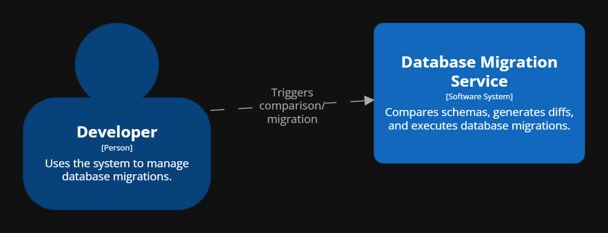
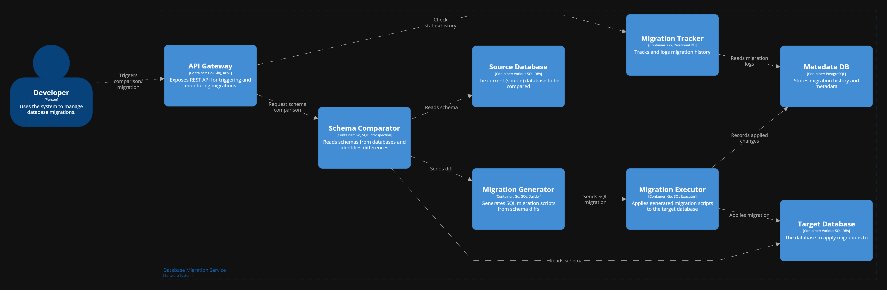

# Database Migration Service - Architecture Documentation

This document describes the architecture of the **Database Migration Service**, which is used for comparing database schemas, generating diffs, and applying migration scripts.

## System Context

The **Database Migration Service** is used by:

- **Developer**: Manually triggers schema comparisons and database migrations through the REST API.

### Main System: Database Migration Service

This system handles schema introspection, migration generation, execution, and tracking.

---

## Container View

The **Database Migration Service** consists of several containers:

### Containers

- **API Gateway**  
  *Technology:* Go (Gin), REST  
  Exposes endpoints for initiating comparisons and monitoring migration progress.

- **Schema Comparator**  
  *Technology:* Go, SQL Introspection  
  Connects to the source and target databases, reads schemas, and computes differences.

- **Migration Generator**  
  *Technology:* Go, SQL Builder  
  Converts schema diffs into executable SQL migration scripts.

- **Migration Executor**  
  *Technology:* Go, SQL Executor  
  Runs migration scripts against the target database and updates tracking metadata.

- **Migration Tracker**  
  *Technology:* Go, Relational DB  
  Provides a view into past migrations and tracks ongoing ones.

- **Metadata DB**  
  *Technology:* PostgreSQL  
  Stores the history and metadata of all migrations applied.

- **Source Database**  
  *Technology:* Various SQL DBs  
  The current schema that serves as a baseline for comparison.

- **Target Database**  
  *Technology:* Various SQL DBs  
  The destination where the migration is applied.

### Key Interactions

- API delegates schema comparison, which involves reading from both source and target databases.
- Detected diffs are passed to the Migration Generator to create SQL scripts.
- Migration Executor runs the script and updates the Metadata DB.
- Migration Tracker retrieves migration status/history from the Metadata DB.

---

## Diagram Sources

- [System Context Diagram](../assets/system-context.png)
- [Container Diagram](../assets/container-diagram.png)
